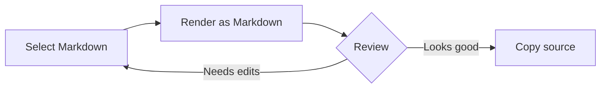

# Release Review

Use Web Markdown Renderer to read selected Markdown directly in the current tab.

## Checklist

- [x] Render GitHub Flavored Markdown
- [x] Preview Mermaid diagrams
- [x] Keep selected text local in the browser
- [ ] Share the final notes with the team

## Workflow



## Status

| Area | Result |
| --- | --- |
| Tables | Rendered |
| Task lists | Rendered |
| Mermaid | Rendered |
| Privacy | Local processing |

## Example

```js
const message = "Markdown rendered locally";
console.log(message);
```

> Selected text stays in the current browser tab.
